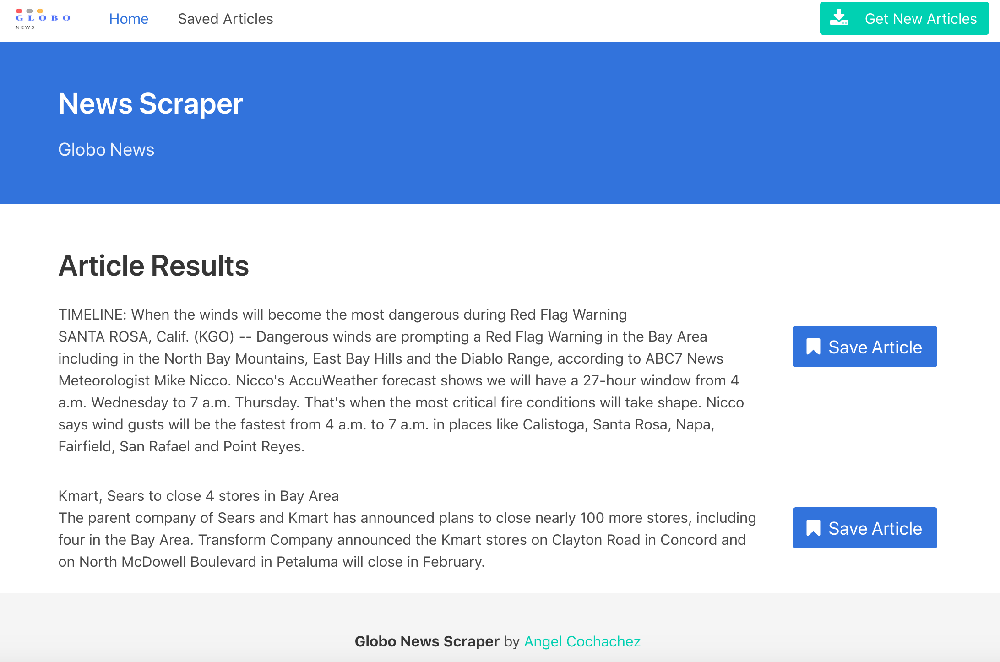
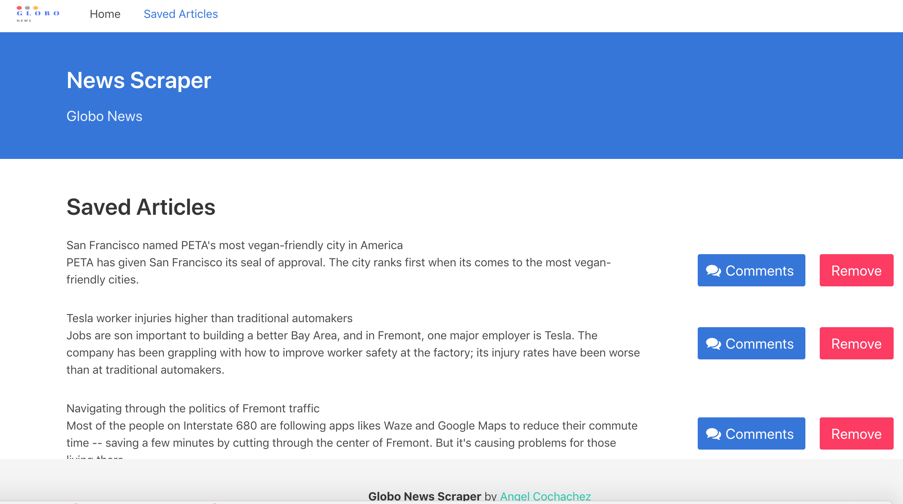
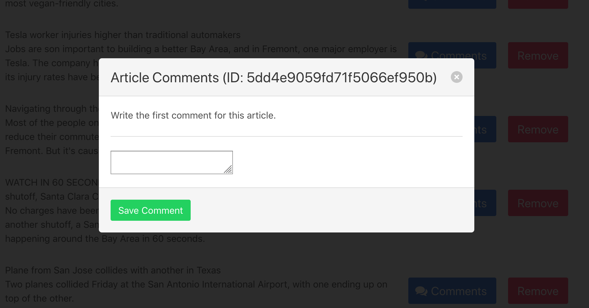

NEWS SCRAPER 
============

## Description

This app allows users to view NPR News articles, save their favorites onto another page, and comment on their favorites. Each article displayed includes a headline which is also a link to the source article and a description that includes the date of publish. There is a 'remove' button next to each article on the saved articles page, but currently it does not work. The app uses Node/Express for the server and routing, MongoDB/Mongoose for the database and models, Handlebars for the layout and views, & Cheerio/Request for scraping the data from https://www.nbcbayarea.com

## Demo
News Scraper is deployed to Heroku. Please check my **[LIVE DEMO](https://scraper2news.herokuapp.com/)**.

## Dependencies

You will need to npm install the following node modules:
1. express = npm express => Install **[express package](https://www.npmjs.com/package/express)**
2. express-handlebars = npm express-handlebars => **[express-handlebars](https://www.npmjs.com/package/express-handlebars)**
3. mongoose = npm mongoose => **[mongoose package](https://www.npmjs.com/package/mongoose)**
4. body-parser = npm body-parser => **[body-parser package](https://www.npmjs.com/package/body-parser)**
5. cheerio = npm cheerio => **[cheerio package](https://www.npmjs.com/package/express)**
6. request = npm request => **[request package](https://www.npmjs.com/package/request)**

Since I have included a package.json file, you do not need to install dependencies by name. Simply run the following in the root of your directory:

> npm i express express-handlebars mongoose body-parser cheerio request

## Getting Started

These instructions will get you a copy of the project up and running on your local machine for development. I will assume that you already have **[Node.js](https://nodejs.org/en/)** and **[MongoDB](https://www.mongodb.com/)** installed locally. See deployment for notes on how to deploy the project on a live system.

* Install dependencies
* In your CLI, enter mongodb or mongo
* In a new CLI Mac, go to the root directory and enter node.js
* in browser
* export PORT=3000
* The app will now be running locally on ***PORT=3000***
* you can access it localy from your browser at your localhost:3000.

# Deployment

1. Follow these instructions to deploy your app live on Heroku

2. Create a heroku app "name" in heroku website
3.  Follow the deployment options in your "terminal" to deploy to heroku:
>- heroku login
>- heroku git:remote -a <app name>
>- git add .
>- git commit -m "heroku deploy"
>- git push heroku master

# Screen-Shot

>Home Page - "News Scraper"

>Save - "Saved Articles"

>Comments - "Article Comments"

# Built With

- Visual Studio Code - Text Editor
- Heroku
- Javascript
- Node.js
- Terminal/Gitbash

# Author

>-  **[Angel-Cochachez](https://github.com/codifyme/ALL-THE-NEWS-THAT-S-FIT-TO-SCRAPE)**. 

